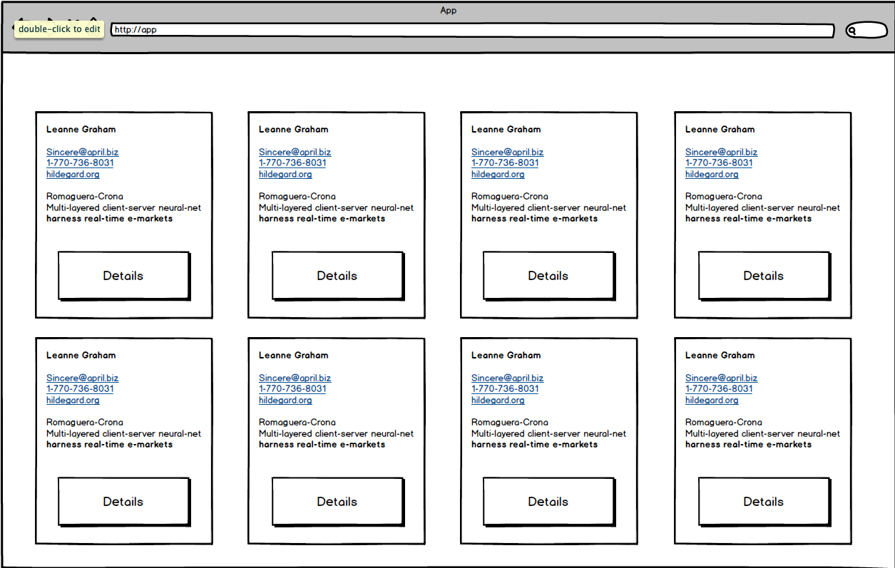
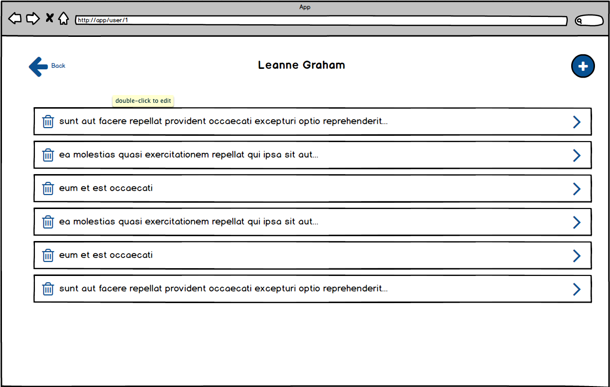
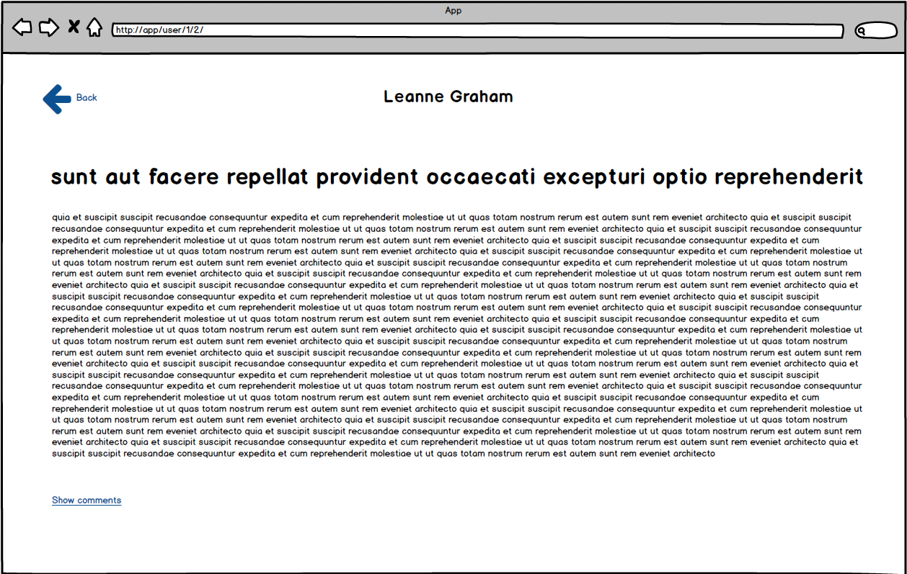
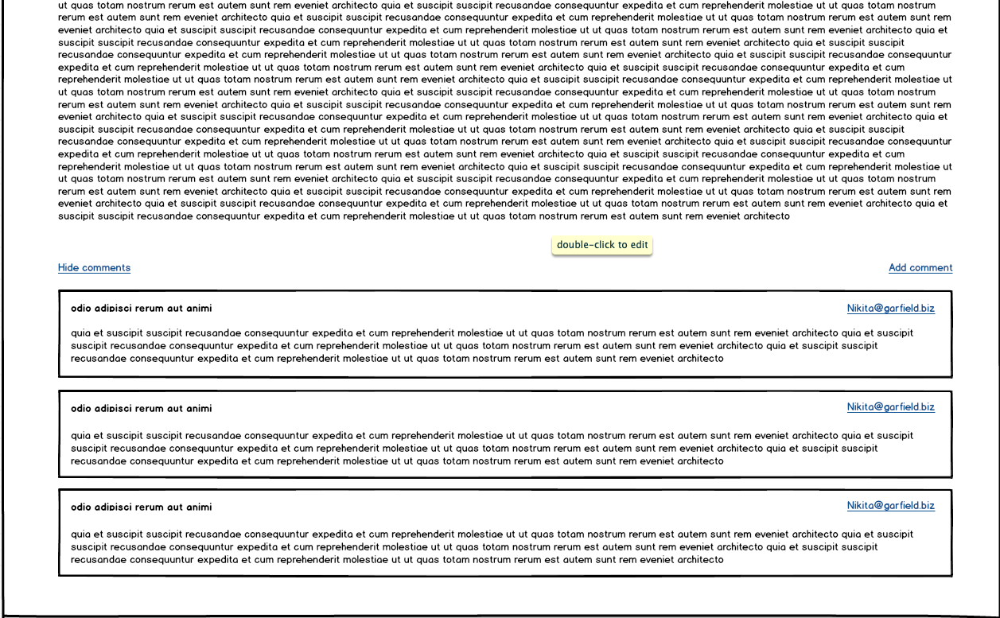
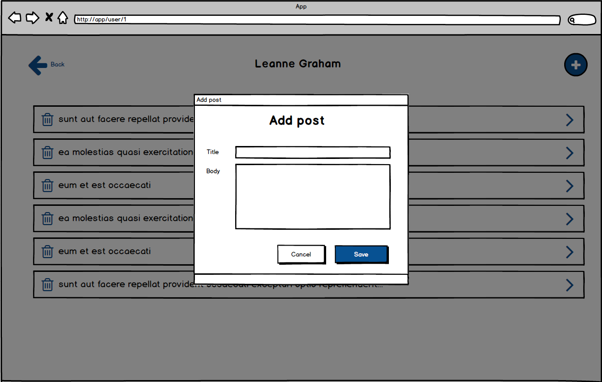
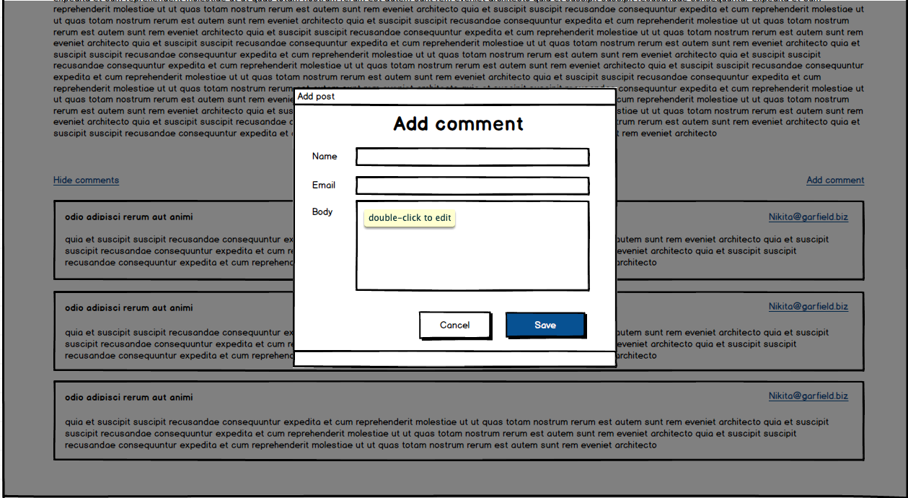

# React Developer Recruitment Task 

## Description
Your job is to code an app with posts of users with ability to manage posts and comments. Application must be SPA and use multiple routes (listed below). 

## Screens:
* `Homepage` 
    
    * List of users. 
    * For each user you must display his details (you can omit the address). 
    * On user click you will redirect to `User Details` page
* `User Details`
    
    * This page contains the user name at the top of the page.
    * List of user posts (just titles trimmed to one line).
    * On click on the post item you will redirect to `Post Details` page
    * Button that on click will open the  `Add post modal`. 
    * Back button that will go back to `Homepage`
* `Post Details`
    
    
    * On top of the page you still have the username
    * Post full details 
    * Button to remove post. 
    * On remove you will have to go back to `User Details` page and remove current post from the list and API.
    * Button/link for comments 'show/hide comments' that will toggle the comments list visibility.
    * Button to add comment.
    * Adding comments should be similar to `Add Post Modal` but contain different fields and action.
    * Back button that will go back to `Posts list
*  `Add Post/Comment Modal`
    
    
    *   Title
    *   Form fields
    *   Two buttons `Cancel`, `Save`
    *   Cancel will just close the modal and ignore changes
    *   Save will connect with API and add Comment/Post to the list